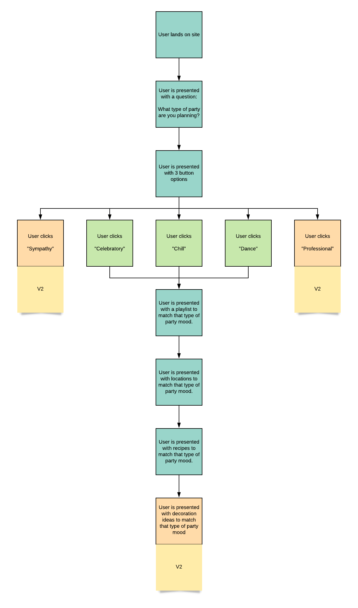
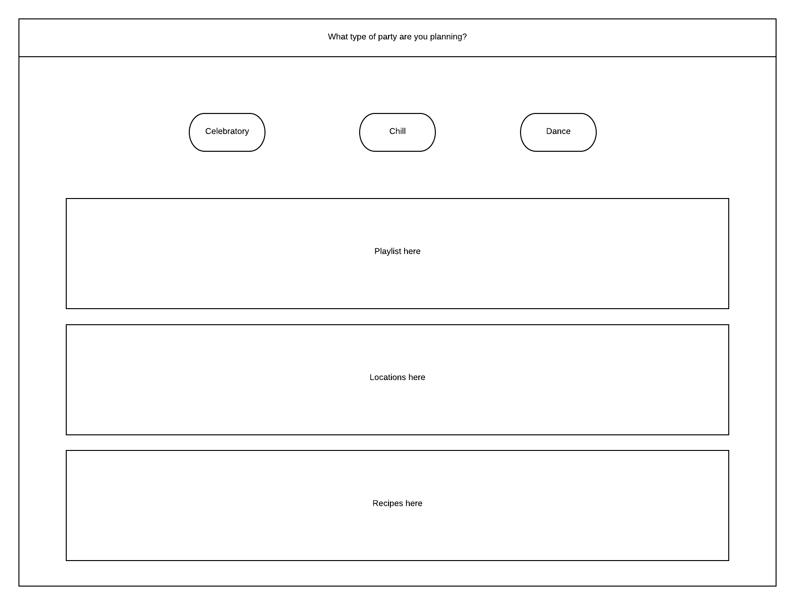
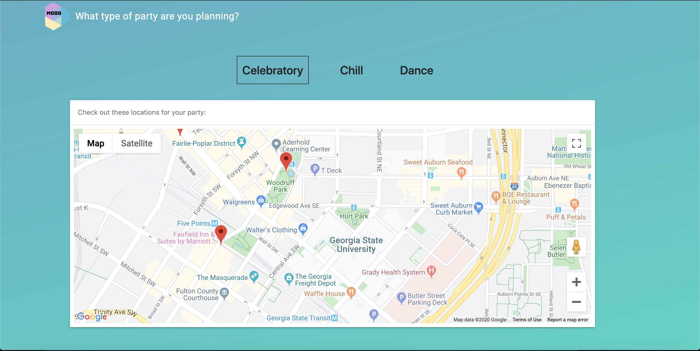

# VIBE

## Links

https://drewhowell.github.io/MoodProject/

## Purpose
Planning a party can be super overwhelming and often times it’s hard to even know where to begin. Here at VIBE, we wanted to provide a solution that gets our users started down a path that will hopefully help make the planning process easier and more manageable. This application allows a user to select what type of party they're trying to plan (celebratory, chill, or dance and receive matching locations, playlists, & recipes.

## Description
As a person planning a party, I want to see suggestions for party ideas so that I don’t have to spend the extra time coming up with everything on my own.

When the user lands on the page, they're presented with a question of: What type of party are you planning?

The user is then presented with 3 button options: Celebratory, Chill, & Dance.

Clicking on a button displays songs, locations, & recipes below that match the party type of the button clicked.

This app uses the iTunes API for a list of songs, the Google Maps API for locations, the Edamam API for recipes, and the Granim.js API for background color transitions. 

This app is built with the Material UI design framework.

## User Flow

## Wireframe

## Working Site

