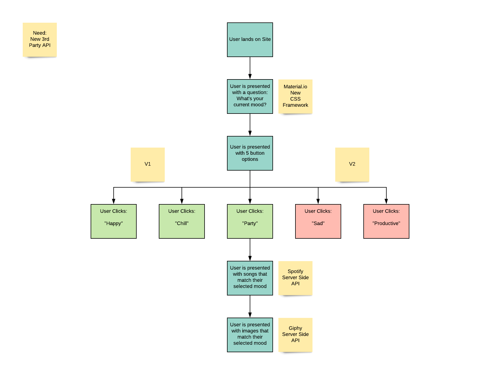

# Mood

## Links

https://drewhowell.github.io/MoodProject/

## Purpose
Music & images reflect the way people feel. This application allows a user to input how they feel and receive matching sounds and visuals.

## Description
As a human with feelings, I want to listen to music and view content that matches the way I'm feeling so that I can really connect with my environment.

When the user lands on the page, they're presented with a question of: What's your current mood?

The user is then presented with 3 button options: Happy, Chill, & Sad.

Clicking on a button displays songs & images below matching the emotion of the button clicked.

This app uses the Spotify API for a list of songs and the Giphy API for a list of images.

This app is built with the material css framework.

(insert information about new server side API used)

## User Flow

## Wireframe

